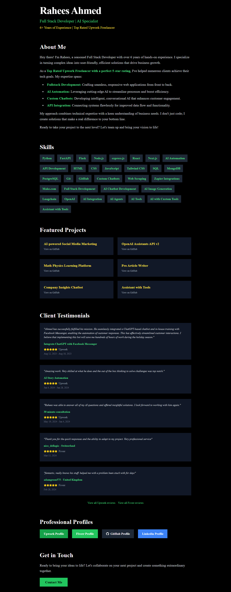

# Rahees Ahmed - Personal Portfolio



## 🚀 Live Demo

[View Live Portfolio](https://raheesahmed.com)

## 🛠️ Built With

- [Next.js](https://nextjs.org/) - React framework for production
- [React](https://reactjs.org/) - JavaScript library for building user interfaces
- [Tailwind CSS](https://tailwindcss.com/) - Utility-first CSS framework
- [Framer Motion](https://www.framer.com/motion/) - Animation library for React
- [TypeScript](https://www.typescriptlang.org/) - Typed superset of JavaScript

## 🌟 Features

- Responsive design
- Animated UI elements
- Dark mode
- Showcases projects, skills, and testimonials
- Contact form

## 🚀 Getting Started

### Prerequisites

- Node.js (v14 or later)
- npm or yarn

### Installation

1. Clone the repository:
   ```bash
   git clone https://github.com/RaheesAhmed/personal-portfolio.git
   ```

2. Navigate to the project directory:
   ```bash
   cd personal-portfolio
   ```

3. Install dependencies:
   ```bash
   npm install
   # or
   yarn install
   ```

4. Run the development server:
   ```bash
   npm run dev
   # or
   yarn dev
   ```

5. Open [http://localhost:3000](http://localhost:3000) in your browser to view the portfolio.

6. Contributations
   Pull request are wellcome , kinldy create the new branch and push to it 

